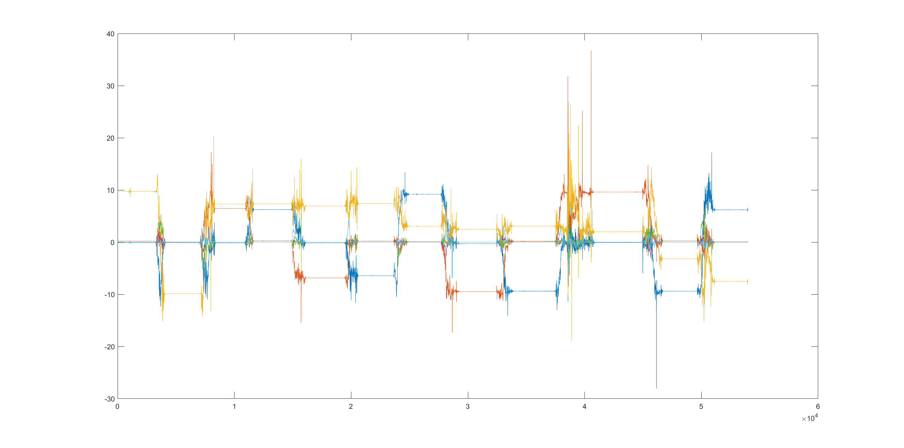
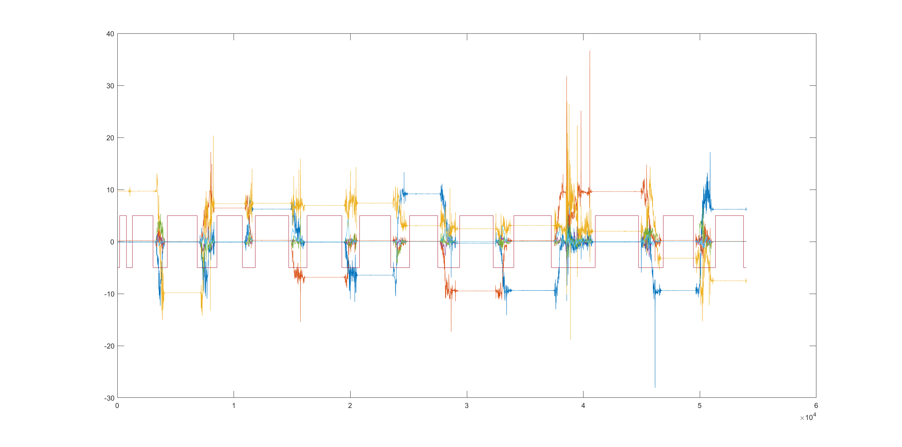

# imu-bias-gravity-calibrator

A c++ project to calibrate the 6 axis biases of an imu sensor, and local gravity magnitude.

## Dependency

- cere solver
- Eigen
- imu tk (https://github.com/Kyle-ak/imu_tk)

The CMakeLists.txt assumes you have Ceres and Eigen installed in your system. You can also modify it to link to external built libs. 

The imu tk package is slightly modified and included as a third-party folder, and is only used for static data range detection and extraction.

## The principle of the calibration

1. For acc biases, a cost function is defined as 

 

or as 

 

and solved by ceres solver to get gravity norm and 3 axis acc biases.

2. Gyr biases is just average of all static gyr interval means.

## How to use

Record static imu data from multiple(better > 10) positions. The orientations of the positions need to be diversed for better calibration result. 

The data sequence should begin with a static period longer than 2s to provide a reference for the program about what's "static". The program will automatically detect static intervals of the whole data sequence, based on the variance it calculates from the initial 2s. 

The size of the sliding window for static detection is 400 data samples, so you have to make sure that every static data intervals contains data samples more than 400. This number is hardcoded in the program for now, and you are free to modify it in main.cpp. You can control the number of samples in each static interval by controlling the time the sensor being static, given the imu sensor frequency. 

Name the imu data file "imu.csv", and its format should be rows of [timestamps, ax, ay, az, rx, ry, rz]. Put the imu.csv in the same folder as the CMakeLists.txt. 

Run the program and find the calibration log and result in the terminal. 

## Check the results

1. Check the calibration values

The correct gravity magnitude should be around 9.8, otherwise the 6 biases you got are likely to be wrong. 

2. Check the correctness of static data intervals detection

The program will create a "static_detect_visual.csv" file to indicate the static data intervals it extracts from your input "imu.csv" file. By visualizing these two files, you can validate the correctness of the static intervals detection and extraction. Below are two plots from Matlab as an example:

3. Check the ceres report

Check the convergence and final cost in the ceres report to make sure nothing is wrong with the optimization.

